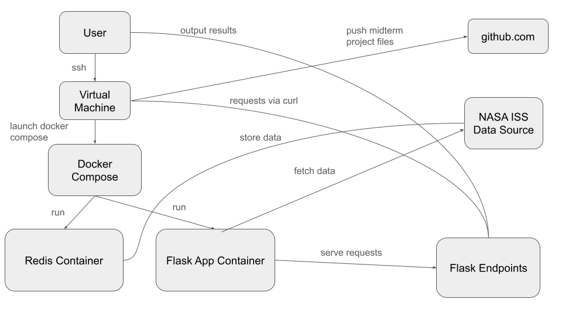

# Midterm Project: ISS Tracker

***Project Overview:*** 

This project is a Flask API that fetches, processes, and analyzes real-time orbital data for the International Space Station (ISS).
It uses Redis for persistent data storage.
The API ingests Orbital Ephemeris Message (OEM) XML data from NASA, parses it, and provides key insights through REST API endpoints, including:
1. All available timestamps (epochs) for the ISS position and velocity
2. Filtered timestamps (using **limit** and **offset**)
3. State vectors (position & velocity) for a specific timestamp
4. Instantaneous speed for a given epoch
5. Geolocation (latitude, longitude, altitude & geopositon) for a given epoch
5. Real-time ISS position, velocity, speed, and geolocation data for the closest epoch to "now"  

***Python Scripts:***
* iss_tracker.py
  - The main Flask API that: 
    + Fetches ISS trajectory from NASA's OEM dataset   
    + Parses and processes the dataset
    + Defines Flask routes for data retrieval including ISS state vectors, speed, and geolocation
* test_iss_tracker.py
  - Contains unit tests for validating functionality within iss_tracker.py:
    + Speed calculations accuracy
    + Epoch selection logic
    + API endpoint responses  

***Data:***

The ISS trajectory data is publicly available from NASA’s Orbital Ephemeris Message (OEM) API:

https://nasa-public-data.s3.amazonaws.com/iss-coords/current/ISS_OEM/ISS.OEM_J2K_EPH.xml

This dataset contains 15 days of ISS position and velocity data and is constantly updated.   

***Deploying the App:*** 
1. Navigate to Project Directory
2. Create and start docker containers (Flask & Redis): docker-compose up --build -d
    - The Flask API will run locally at http://localhost:5000

**OR (pull directly from DockerHub):** 
1. docker pull vigneshwinner/iss_tracker:1.0
2. docker run -p 5000:5000 vigneshwinner/iss_tracker:1.0

***Accessing the Flask API:***

Once the API is running, to access and test the endpoints:

* curl http://127.0.0.1:5000/epochs
    - Returns all available timestamps in the dataset
* curl "http://127.0.0.1:5000/epochs?limit=5&offset=2"
    - Filters epochs using **limit** and **offset** query parameters
* curl "http://127.0.0.1:5000/epochs/*specific epoch*"
    - Fetches ISS position and velocity for a specific epoch
* curl "http://127.0.0.1:5000/epochs/*specific epoch*/speed"
    - Computes the ISS speed at a specific epoch
* curl "https://127.0.0.1:5000/epochs/*specific epoch*/location"
    - Computes the ISS latitude, longitude, altitude, and geoposition for a specific epoch
* curl http://127.0.0.1:5000/now
    - Finds the closest timestamp to the current time and returns real-time ISS data 

***Running Containerized Unit Tests (Tests ensure API functionality and correctness of calculations):***
1. Start containers (if not running): docker-compose up --build -d
2. Run unit tests inside Flask container: docker-compose exec flask-app pytest test_iss_tracker.py

***Software Diagram***

